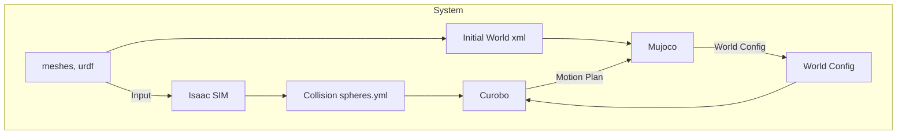
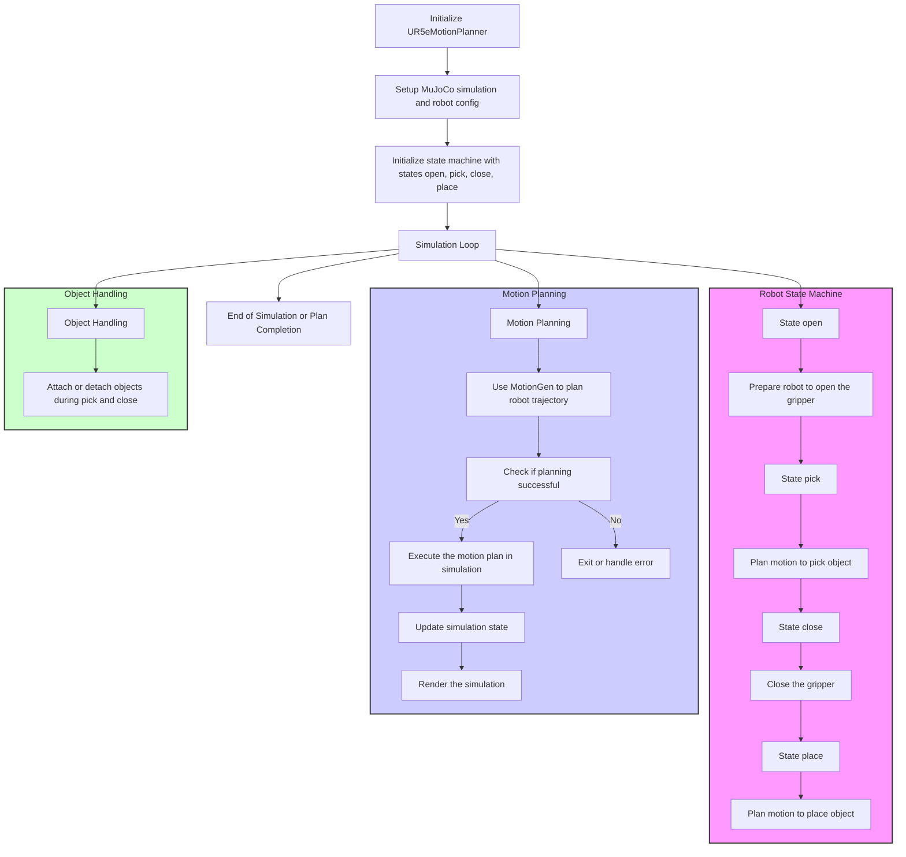

```mermaid
graph TD;
    subgraph System
        A[meshes, urdf] -->|Input| B[Isaac SIM]
        A --> C[Initial World xml]
        B --> D[Collision spheres.yml]
        C --> E[Mujoco]
        D --> F[Curobo]
        E -->|World Config| G[World Config]
        G --> F
        F -->|Motion Plan| E
    end
```

```mermaid
flowchart TD
    %% State Machine: Initialization and Setup
    A[Initialize UR5eMotionPlanner] --> B[Setup MuJoCo simulation and robot config]
    B --> C[Initialize state machine with states open, pick, close, place]

    %% State Machine: Robot States
    subgraph states [Robot State Machine]
        direction TB
        E[State open] --> F[Prepare robot to open the gripper]
        F --> H[State pick]
        H --> I[Plan motion to pick object]
        I --> K[State close]
        K --> L[Close the gripper]
        L --> N[State place]
        N --> O[Plan motion to place object]
    end

    %% State Machine: Motion Planning
    subgraph motion_planning [Motion Planning]
        direction LR
        Q[Motion Planning] --> R[Use MotionGen to plan robot trajectory]
        R --> S[Check if planning successful]
        S -->|Yes| T[Execute the motion plan in simulation]
        S -->|No| U[Exit or handle error]
        T --> V[Update simulation state]
        V --> W[Render the simulation]
    end

    %% State Machine: Object Handling
    subgraph object_handling [Object Handling]
        direction LR
        X[Object Handling] --> Y[Attach or detach objects during pick and close]
    end

    %% State Machine: Main Loop & Transitions
    C --> D[Simulation Loop]
    D --> E
    D --> Q
    D --> X
    D --> Z[End of Simulation or Plan Completion]

    %% Colors for clarity
    classDef state_machine fill:#f9f,stroke:#333,stroke-width:2px;
    classDef planning fill:#ccf,stroke:#333,stroke-width:2px;
    classDef object_handling fill:#cfc,stroke:#333,stroke-width:2px;

    class states state_machine;
    class motion_planning planning;
    class object_handling object_handling;


```

