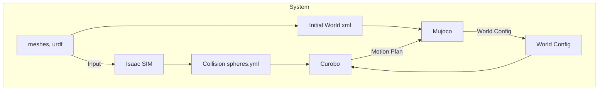
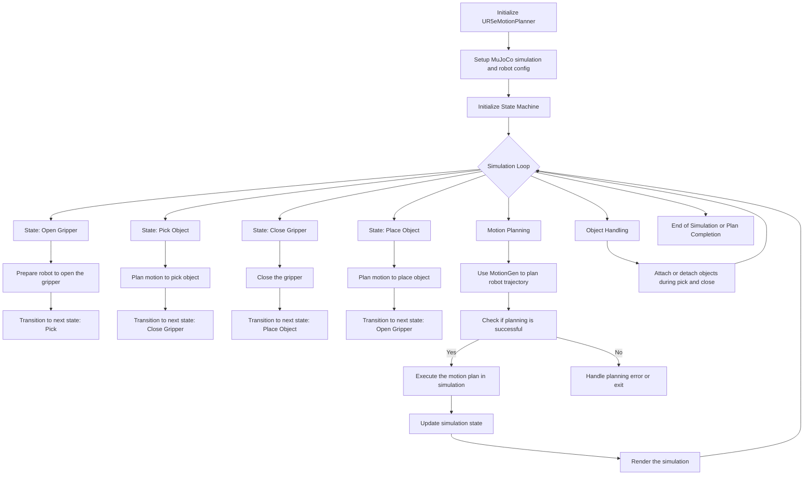

```mermaid
graph TD;
    subgraph System
        A[meshes, urdf] -->|Input| B[Isaac SIM]
        A --> C[Initial World xml]
        B --> D[Collision spheres.yml]
        C --> E[Mujoco]
        D --> F[Curobo]
        E -->|World Config| G[World Config]
        G --> F
        F -->|Motion Plan| E
    end
```

```mermaid
flowchart TD
    A[Initialize UR5eMotionPlanner] --> B[Setup MuJoCo simulation and robot config]
    B --> C[Initialize State Machine]
    C --> D{Simulation Loop}
    
    D --> E[State: Open Gripper]
    E --> F[Prepare robot to open the gripper]
    F --> G[Transition to next state: Pick]
    
    D --> H[State: Pick Object]
    H --> I[Plan motion to pick object]
    I --> J[Transition to next state: Close Gripper]
    
    D --> K[State: Close Gripper]
    K --> L[Close the gripper]
    L --> M[Transition to next state: Place Object]
    
    D --> N[State: Place Object]
    N --> O[Plan motion to place object]
    O --> P[Transition to next state: Open Gripper]
    
    D --> Q[Motion Planning]
    Q --> R[Use MotionGen to plan robot trajectory]
    R --> S[Check if planning is successful]
    S -->|Yes| T[Execute the motion plan in simulation]
    S -->|No| U[Handle planning error or exit]
    
    T --> V[Update simulation state]
    V --> W[Render the simulation]
    
    D --> X[Object Handling]
    X --> Y[Attach or detach objects during pick and close]
    
    D --> Z[End of Simulation or Plan Completion]
    
    W --> D
    Y --> D
```

