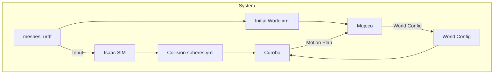

```mermaid
graph TD;
    subgraph System
        A[meshes, urdf] -->|Input| B[Isaac SIM]
        A --> C[Initial World xml]
        B --> D[Collision spheres.yml]
        C --> E[Mujoco]
        D --> F[Curobo]
        E -->|World Config| G[World Config]
        G --> F
        F -->|Motion Plan| E
    end
```
