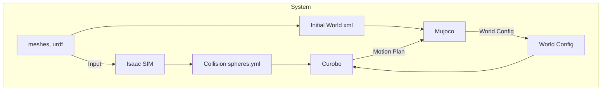
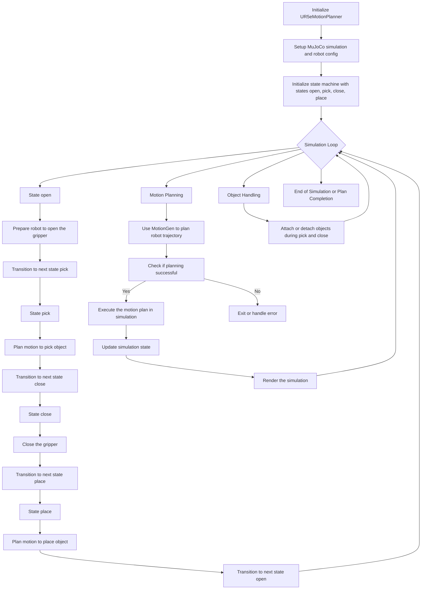

```mermaid
graph TD;
    subgraph System
        A[meshes, urdf] -->|Input| B[Isaac SIM]
        A --> C[Initial World xml]
        B --> D[Collision spheres.yml]
        C --> E[Mujoco]
        D --> F[Curobo]
        E -->|World Config| G[World Config]
        G --> F
        F -->|Motion Plan| E
    end
```

```mermaid
flowchart TD
    A[Initialize UR5eMotionPlanner] --> B[Setup MuJoCo simulation and robot config]
    B --> C[Initialize state machine with states open, pick, close, place]
    C --> D{Simulation Loop}
    D --> E[State open]
    E --> F[Prepare robot to open the gripper]
    F --> G[Transition to next state pick]
    G --> H[State pick]
    H --> I[Plan motion to pick object]
    I --> J[Transition to next state close]
    J --> K[State close]
    K --> L[Close the gripper]
    L --> M[Transition to next state place]
    M --> N[State place]
    N --> O[Plan motion to place object]
    O --> P[Transition to next state open]
    P --> D
    D --> Q[Motion Planning]
    Q --> R[Use MotionGen to plan robot trajectory]
    R --> S[Check if planning successful]
    S -->|Yes| T[Execute the motion plan in simulation]
    S -->|No| U[Exit or handle error]
    T --> V[Update simulation state]
    V --> W[Render the simulation]
    W --> D
    D --> X[Object Handling]
    X --> Y[Attach or detach objects during pick and close]
    Y --> D
    D --> Z[End of Simulation or Plan Completion]

```

